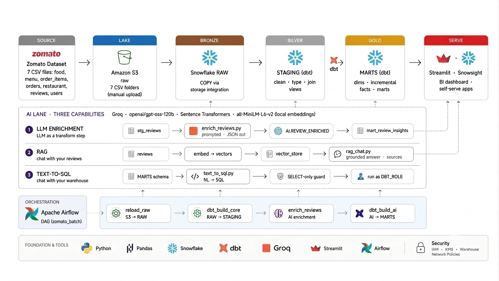

# Food Delivery AI Data Pipeline — End-to-End Data Engineering Project

A complete batch data pipeline that takes Zomato-style food delivery data from raw CSVs all the way to AI-powered analytics:

**Zomato/Food Delivery Dataset → Amazon S3 → Snowflake → dbt → Airflow → AI (Groq)**

The dataset lands in an S3 data lake and flows into Snowflake through a storage integration, where dbt transforms it through medallion layers — RAW (Bronze) tables loaded via `COPY INTO`, cleaned STAGING (Silver) views, and business-ready MARTS (Gold) with dimensions, incremental facts, and aggregate marts. Apache Airflow orchestrates the whole pipeline as one daily DAG. On top of the warehouse sits an AI lane: LLM enrichment turns free-text reviews into structured, queryable columns; RAG lets you chat with your reviews; and text-to-SQL lets you query the warehouse in plain English. Streamlit serves the AI apps.



## What gets built

| Layer | Where | What |
|---|---|---|
| **Source** | `data/` (local) | Restaurant, user, food, and menu dimension CSVs + fact files for orders, order items, and free-text reviews |
| **Lake** | Amazon S3 | One bucket, `raw/<table>/` folder per CSV |
| **Bronze** | Snowflake `ZOMATO.RAW` | `COPY INTO` from S3 via a keyless storage integration |
| **Silver** | Snowflake `ZOMATO.STAGING` | dbt staging views — clean, type, rename every source |
| **Gold** | Snowflake `ZOMATO.MARTS` | Dimensions, incremental facts (MERGE), business marts |
| **AI** | Snowflake `ZOMATO.AI` | LLM-enriched reviews (sentiment/topic), RAG chat, text-to-SQL |
| **Orchestration** | Airflow (Docker) | One daily DAG: load → transform → enrich → AI mart |

## Tech stack

Python · Pandas · Amazon S3 · Snowflake · dbt (dbt-snowflake) · Apache Airflow 3 (Docker) · Groq (`openai/gpt-oss-120b`) · Sentence Transformers (`all-MiniLM-L6-v2`, local embeddings) · Streamlit

## Repository structure

```
├── airflow/                  # Airflow 3 on Docker
│   ├── Dockerfile            #   Snowflake provider, dbt in its own venv
│   ├── docker-compose.yaml   #   postgres + api-server + scheduler; creds via env vars
│   ├── .env                  #   SNOWFLAKE_* / GROQ_API_KEY (gitignored, not committed)
│   └── dags/zomato_batch.py  #   the pipeline DAG (4 tasks)
├── zomato/                   # dbt project
│   ├── models/staging/       #   7 staging views (Silver) + sources + tests
│   ├── models/marts/         #   dims, incremental facts, business marts (Gold)
│   └── macros/               #   custom schema-name macro
├── ai/                       # AI layer
│   ├── enrich_reviews.py     #   LLM enrichment → ZOMATO.AI.REVIEW_ENRICHED (Groq)
│   ├── rag_chat.py           #   RAG — "chat with your reviews" (Streamlit, local embeddings)
│   ├── text_to_sql.py        #   text-to-SQL — "chat with your warehouse" (Streamlit)
│   └── .env                  #   AI credentials (gitignored, not committed)
├── snowflake/                # Snowflake setup SQL (run in Snowsight, in order)
│   ├── 01_setup.sql          #   warehouse, database, schemas, role
│   ├── 02_storage_integration.sql  # keyless S3 storage integration
│   ├── 03_stage_and_formats.sql    # external stage + CSV file format
│   ├── 04_raw_tables.sql     #   RAW (Bronze) table DDL, column order matches the CSVs
│   └── 05_copy_into.sql      #   COPY INTO RAW from the stage
└── architecture.png     # architecture diagram
```

> `data/` (raw CSVs), `.env` files, logs, and dbt `target/` artifacts are intentionally not committed to keep the repo lightweight and credentials out of version control.
>
> The AWS-side IAM setup for the S3 ↔ Snowflake integration was set up directly in the AWS console rather than committed as files here, since they contain account-specific identifiers.

## How the pipeline works

### 1 · Data lands in S3

The seven CSVs are uploaded to `s3://<BUCKET>/raw/<table>/` — one folder per table (`restaurants/`, `users/`, `food/`, `menu/`, `orders/`, `order_items/`, `reviews/`).

### 2 · S3 → Snowflake

Snowflake reads the bucket with no stored keys, using a storage integration + an IAM role. The Snowflake side is `snowflake/02_storage_integration.sql`. The AWS side (an IAM policy for read-only bucket access, and an IAM role with a trust policy referencing Snowflake's IAM user ARN and external ID) was set up directly in the AWS console rather than committed as files here, since they contain account-specific identifiers.

The order matters: create the AWS policy + role → create the Snowflake `STORAGE INTEGRATION` pointing at the role ARN → `DESC INTEGRATION` to get `STORAGE_AWS_IAM_USER_ARN` and `STORAGE_AWS_EXTERNAL_ID` → paste both into the role's trust policy. (Two hard-won lessons: the trust Principal must be Snowflake's IAM user ARN, not `:root` — and never re-run `CREATE OR REPLACE` on the integration afterward, it regenerates the external ID and breaks the trust.)

### 3 · Load — `COPY INTO`

Table DDL ([`snowflake/04_raw_tables.sql`](snowflake/04_raw_tables.sql)) matches each CSV's column order, then [`snowflake/05_copy_into.sql`](snowflake/05_copy_into.sql) pulls each file from the stage into `ZOMATO.RAW` tables: 10M orders, ~23M order items, 300K reviews.

### 4 · Transform — dbt (medallion)

- **Staging (Silver)** — one view per source: parse the messy restaurant dimension (`--` → null, `₹ 200` → 200), lowercase emails, derive `is_delivered`, etc.
- **Dimensions (Gold)** — `dim_restaurants`, `dim_customer`, `dim_food`, a generated `dim_date` calendar.
- **Facts (Gold, incremental)** — `fct_orders` and `fact_order_items` use `materialized='incremental'` with a MERGE strategy, so a re-run processes only new rows instead of rebuilding everything.
- **Marts (Gold)** — one table per business question: daily city revenue, restaurant performance, delivery SLA, review insights.
- **Tests** — `unique` / `not_null` / `relationships` / `accepted_values`; `dbt build` runs models and tests in dependency order.

### 5 · Orchestrate — Airflow

One daily DAG, [`zomato_batch`](airflow/dags/zomato_batch.py), runs the whole thing as a single graph:

```
reload_raw  →  dbt_build_core  →  enrich_reviews  →  dbt_build_ai
(COPY from S3)  (dbt build + tests)  (Groq enrichment)   (AI mart)
```

Credentials never touch the code: docker-compose injects `SNOWFLAKE_*` / `GROQ_API_KEY` env vars (read by dbt's `profiles.yml` via `env_var()`) and an `AIRFLOW_CONN_SNOWFLAKE_DEFAULT` connection for the COPY task.

### 6 · AI layer — three capabilities

1. **LLM enrichment** (`ai/enrich_reviews.py`) — LLM as a transformation step. Reads review text, asks Groq's `openai/gpt-oss-120b` for structured JSON (sentiment + topic), writes it back to `ZOMATO.AI.REVIEW_ENRICHED` — which dbt then models into `mart_review_insights` like any other table. Idempotent and sample-capped (`SAMPLE_N`) so it never reprocesses the same review twice.
2. **RAG** (`ai/rag_chat.py`) — chat with your reviews. Embeds reviews locally with `all-MiniLM-L6-v2`, retrieves the most similar ones for a question by cosine similarity, and generates an answer grounded in real reviews (with sources shown).
3. **Text-to-SQL** (`ai/text_to_sql.py`) — chat with your warehouse. The LLM gets the marts' schema, writes Snowflake SQL for an English question, and a SELECT-only guard validates it before running as `DBT_ROLE`.

## Running it

```bash
# Snowflake objects (warehouse, database, schemas RAW/STAGING/MARTS/AI, role)
# + the S3 storage integration: run snowflake/01→05 in Snowsight — the AWS-side
# IAM policy/role setup happens in the AWS console.

# dbt
cd zomato
export SNOWFLAKE_ACCOUNT=... SNOWFLAKE_USER=... SNOWFLAKE_PASSWORD=...
dbt debug && dbt build --exclude tag:ai

# Airflow
cd airflow
# create .env with SNOWFLAKE_*, GROQ_API_KEY, SAMPLE_N (see docker-compose.yaml for exact variable names)
docker compose build && docker compose up -d
# http://localhost:8080 → un-pause zomato_batch → Trigger

# AI apps
export GROQ_API_KEY=...
python ai/enrich_reviews.py
streamlit run ai/rag_chat.py      # chat with reviews
streamlit run ai/text_to_sql.py   # chat with the warehouse
```